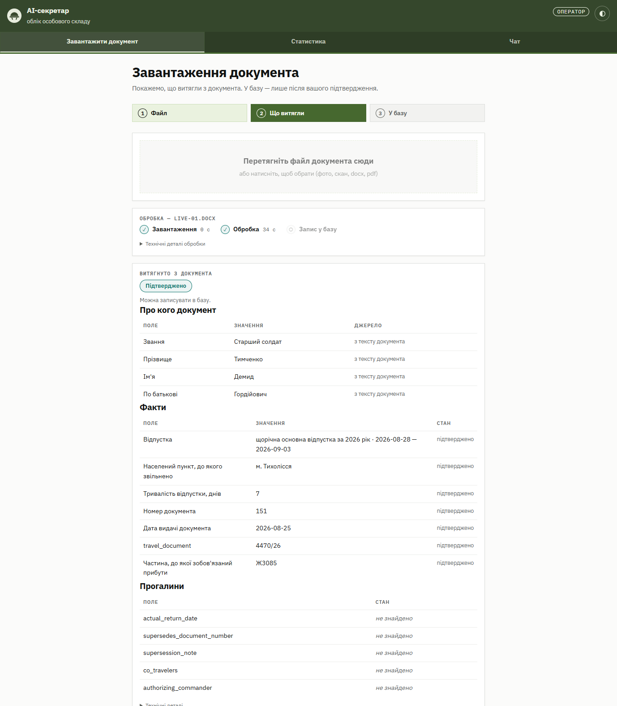
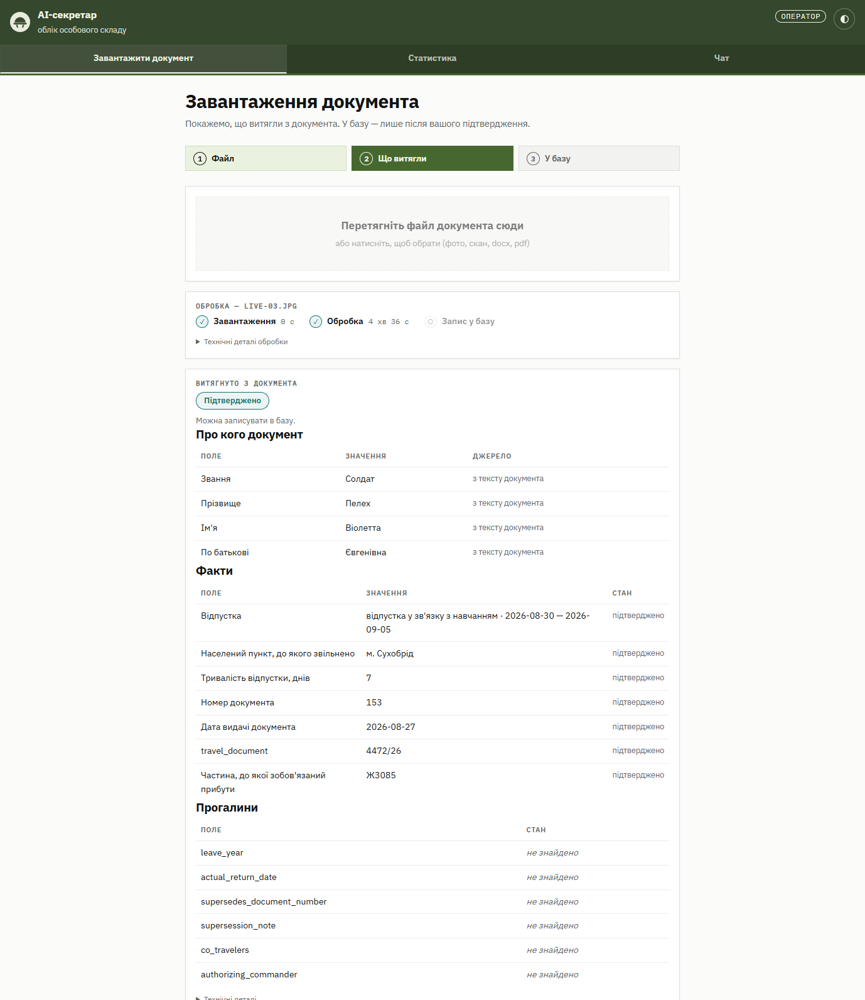
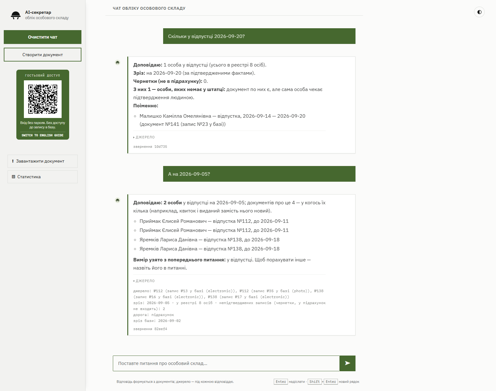
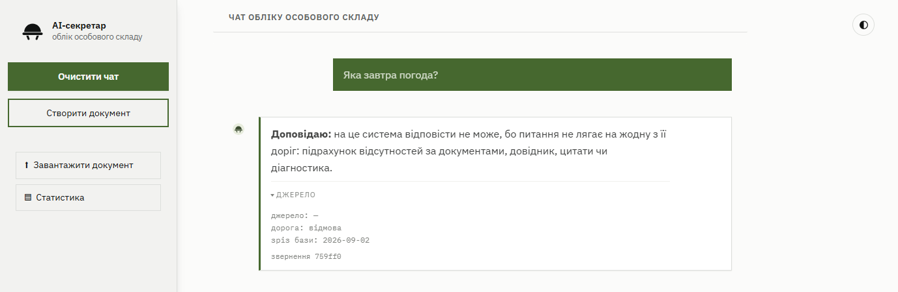
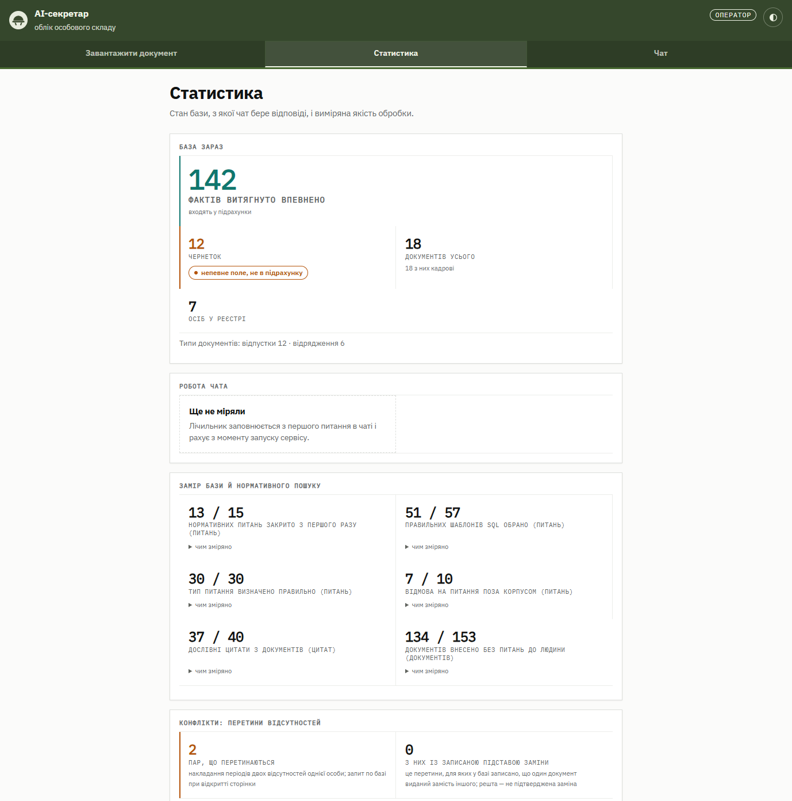

# AI secretary — шар відповіді над документообігом

Капстоун-проєкт №21, KSE Agentic AI Summer School 2026.

## Що це

Замовник — військова частина з великим обсягом паперового документообігу.
Інформація зафіксована в рапортах, наказах, довідках. Щоб отримати зведену
картину, зараз треба обійти кількох людей і порахувати руками — це години або дні.

Система читає документи, дістає з них дані у структурований вигляд і відповідає
на зведені запитання за секунди.

Ми не робимо документообіг — він у замовника вже є. Ми робимо **шар відповіді**
над документами, які вже ходять.

## Дві дороги відповіді

Спільна база документів, два різні механізми. Крок маршрутизації вирішує, якою
дорогою іде конкретне питання.

| | Дорога А — підрахунок | Дорога Б — нормативка |
|---|---|---|
| Питання | «Скільки людей зараз у відпустці?» | «Яка процедура подання заяви на відпустку?» |
| Механізм | факти з документів → цифра | питання → цитата з норм-акта |
| Відповідь | цифра + склад відповіді | цитата + посилання на джерело |

**Склад відповіді** — чотири обов'язкові елементи біля цифри: дата зрізу,
знаменник, кількість непідтверджених, посилання на документ-джерело. Приберемо
одне — людина піде дзвонити, і система не потрібна.

Якщо система не знайшла даних, вона каже «не знайшла». Відмова краща за
вигадану цифру.

## Як це виглядає

Знімки з локального стенда 02.09.2026: Postgres у Docker, 21 синтетичний
документ демо-історії, модель 4B на процесорі. **Усі імена й номери вигадані.**

**Відео (27 с):** [`docs/media/ai-secretary-demo-27s.mov`](docs/media/ai-secretary-demo-27s.mov)
— завантаження документа й питання в чат наскрізь.

**Завантаження документа → що витягли.** Поля з джерелом, стан кожного факту,
і окремо — прогалини. У базу запис іде лише після підтвердження людиною.

**Те саме з фотографією телефоном.** Найгірший вхід: знімок бланка, OCR на
процесорі — 4 хв 36 с на цій машині (на карті — десятки секунд). Поля ті самі,
кожне підтверджене.

**Чат: число, поіменно, наступний хід.** Відповідь несе зріз, кількість
чернеток (у підрахунок не входять), примітку про особу поза штаткою і
розкривне джерело — документ, шаблон і сам запит. «Хто саме?» успадковує вимір
попереднього питання і каже про це.

**Відмова краща за вигадку.** Питання поза доменом отримує відмову з
поясненням, а не найближчу цифру.

**Статистика.** Стан бази, з якої чат бере відповіді: підтверджені факти
окремо від чернеток, заміри якості з полем «чим зміряно», перетини
відсутностей.

## Як запустити

Система працювала на сервері з відеокартою (вимкнений 01.09.2026), і всі
числа в документації зняті там. Локально на звичайній машині конвеєр і
прилади працюють; чат вимагає карти **не менше 20 ГБ** — модель на 27 млрд
параметрів у 4-бітному квантуванні це 16–17 ГБ ваг плюс кеш.

Що потрібно й чого очікувати за швидкістю — `docs/DECISIONS.md`, розділ
«Залізо й розгортання». Правило звідти ж, коротко: **усе в контейнерах**, бо
дві поломки одного дня трапилися саме там, де ми ставили системні пакети на
спільну машину.

## Дані

**У цьому репозиторії немає жодного реального документа замовника.**
Тільки синтетика й шаблони. Це жорстке правило проєкту, не рекомендація —
див. `CLAUDE.md`.

## Команда

| Хто | Ділянка |
|---|---|
| Денис | керування проєктом |
| Аня | розбір документів, пайплайн |
| Андрій | база даних |
| Коля | контент, нормативні джерела |

У кожної ділянки один власник — одне ім'я, яке в будь-який момент відповідає,
у якому це стані і коли запрацює.

## Де що лежить

| Папка | Що там | Власник |
|---|---|---|
| `pipeline/` | розбір документа: OCR → класифікація → витяг полів → нормалізація | Аня |
| `eval/` | вимірювальний прилад: `evaluate.py`, мапінг полів, тести | Аня |
| `db/` | сховище: тека оригіналів + факти (Postgres) | Андрій |
| `demos/upload_app/` | завантажувач документів і чат — те, що бачить людина | Аня |
| `data/eval/` | синтетичні зразки + еталонні відповіді — єдине місце для файлів документів | спільне |
| `docs/` | написане: контракт із базою, архітектура, дослідження, живі списки | спільне |
| `docs/map/` | мапа двох доріг — жива схема архітектури | Денис |
| `data/eval/samples/normative/` | публічні нормативні акти для дороги Б | Коля |

**Звідки починати читання:** [`docs/DECISIONS.md`](docs/DECISIONS.md) — що
вирішено, чому і чим підтверджено. Структура зафіксована в
[`docs/contracts/repo-structure-final.md`](docs/contracts/repo-structure-final.md).
Правило: папка верхнього рівня = ділянка з одним власником; у корінь код не
кладемо, крім `run_pipeline.py` як вхідної точки.
